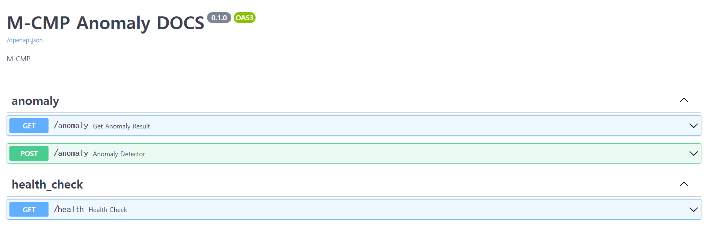
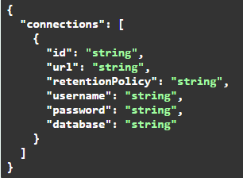
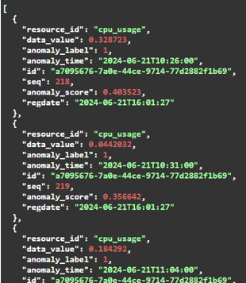

# Anomaly Detection
Anomaly detection was developed to provide integrated analysis technology for multi-cloud operation management using metric data collected in InfluxDB.

## Environment
- python v3.9

## How to Use
1) Clone this repo
```shell
git clone https://github.com/m-cmp/mc-observability/python <YourFolderName>
```
2) After creating and running the virtual environment, install all packages according to your version using requirements.txt.
```shell
pip install -r requirements.txt
```
3) Install all packages according to your version using requirements.txt.
4) runs the VM anomaly detection function using the API. 
5) Run FastAPI server 
```shell
python main.py
```


## API Use guide
### API list



 ### [post] /anomaly Example Value
- id : VM ID (InfluxDB standard VM ID)
- url : InfluxDB Url
- retentionPolicy : InfluxDB database RetentionPolicy
- username : InfluxDB Access Username
- password : InfluxDB Access Password
- database : InfluxDB database Name



 ### [get] /anomaly Example Value
- id : VM ID (InfluxDB standard VM ID)
- Provides anomaly detection results corresponding to VM ID



## How to Contribute
- Issues/Discussions/Ideas: Utilize issue of mc-observability


