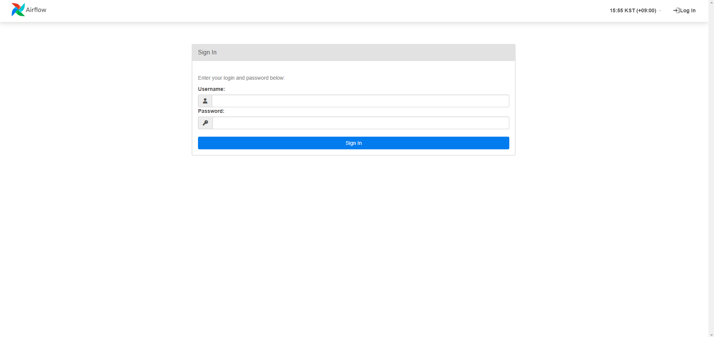
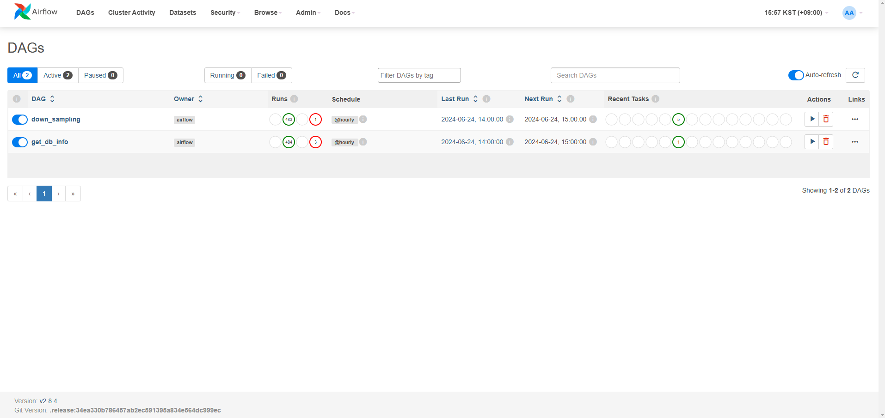
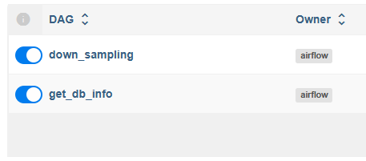

# Down Sampling


## Environment
- python v3.9
- MariaDB v10.7.6
- apache-airflow v2.8.4

## How to Use
### ＊You must have pre-installed MariaDB and installed and configured the MCMP-Agent to use this feature.
1) Clone this repo
```shell
git clone https://github.com/m-cmp/m/c-observability/python <YourFolderName>
```
2) Run the 'mc-db-dump.sql' file in the pre-configured MariaDB.  
3) In the '.env' file, enter the appropriate settings for your personal environment.
4) Run the docker file.
```shell
docker-compose up -d
```
5) You can query compressed data using the Agent-Manager API.


## Use guide
### Login Page
  

ID/PW: admin/admin  
(Account information can be modified from the docker compose file.)

### Scheduler Run
  

When the docker is executed, down sampling is automatically conducted every 1 hour.  

### Control Scheduler Job
  

Scheduler pause/run can be set by clicking the icon.


## How to Contribute
- Issues/Discussions/Ideas: Utilize issue of mc-observability


